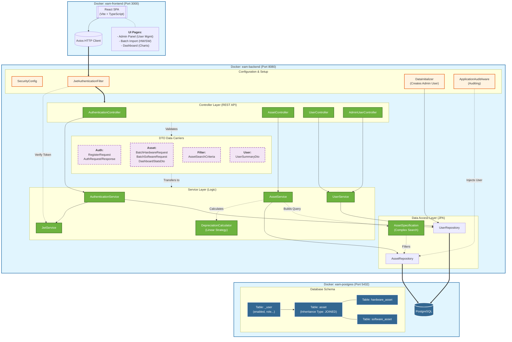
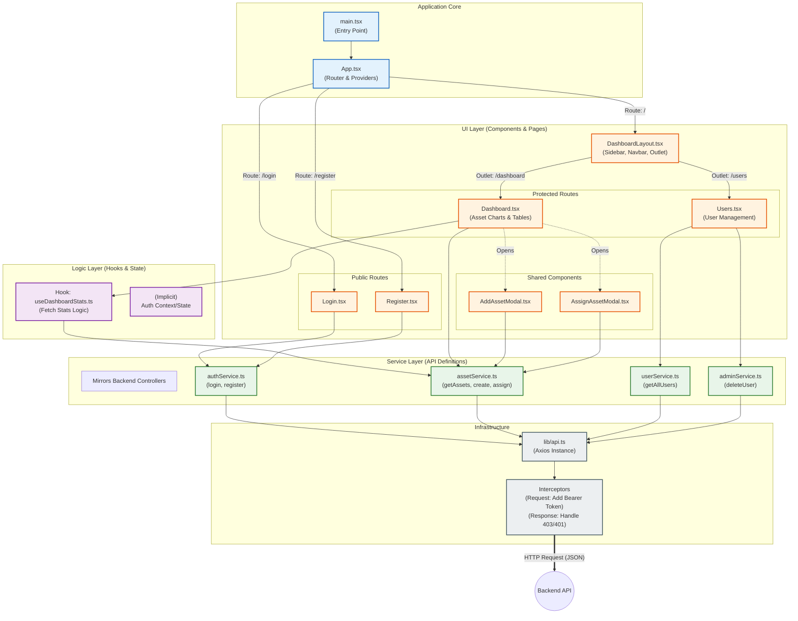
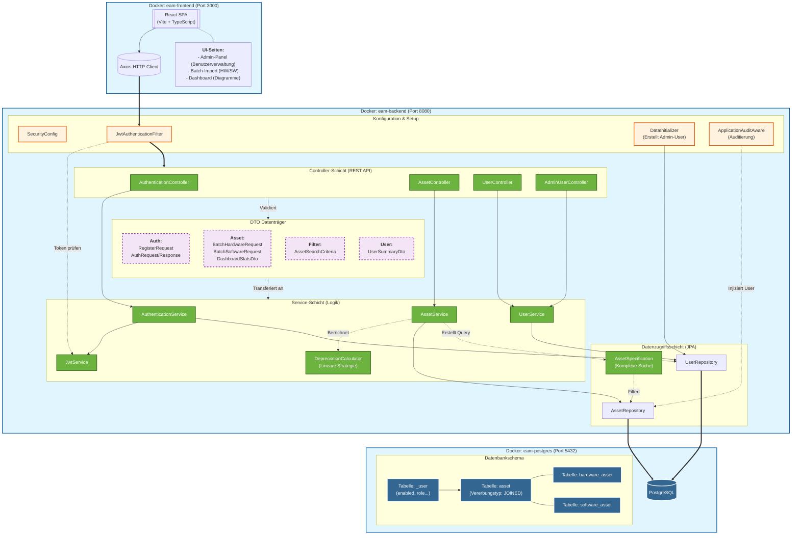
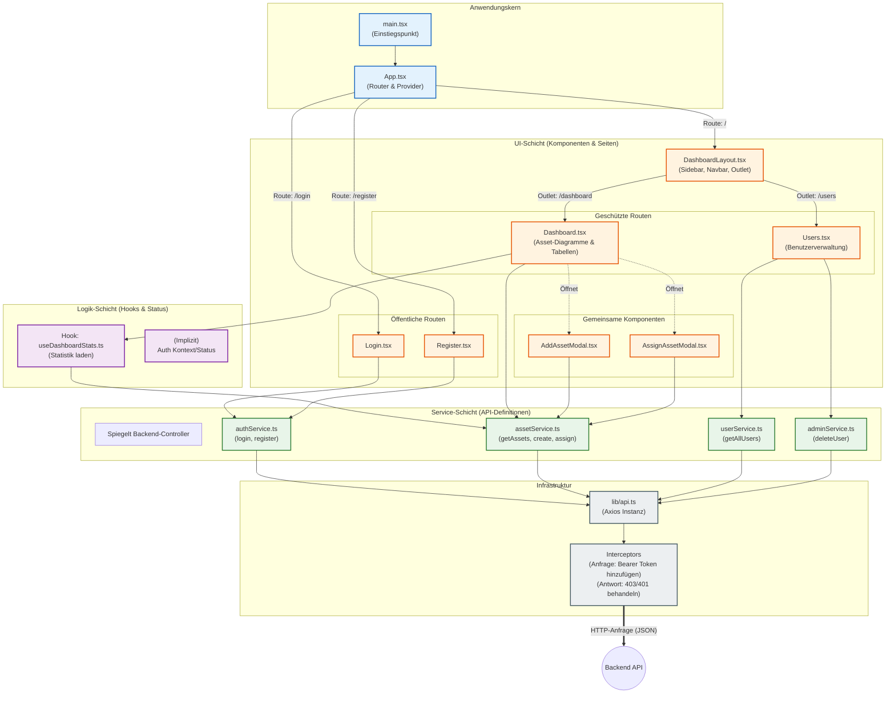
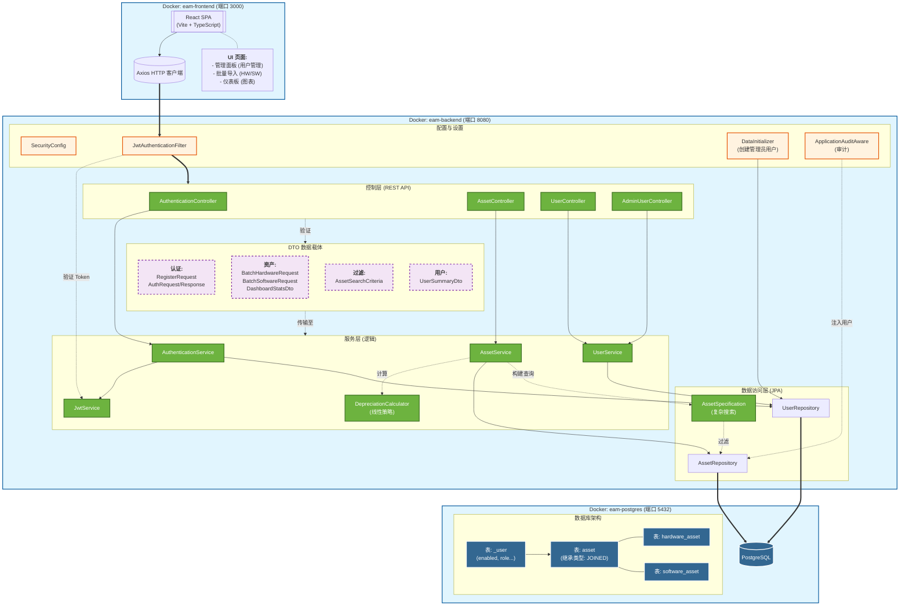
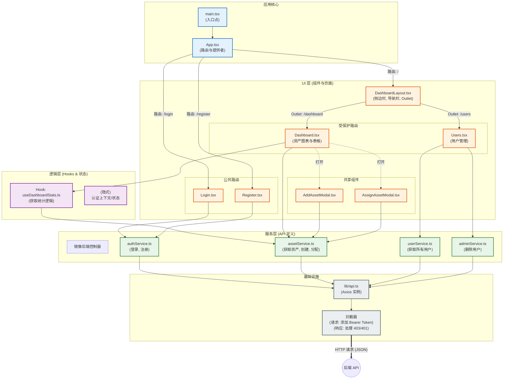

<details open>
<summary><strong>English</strong></summary>

# Enterprise Asset Manager

> A robust, full-stack solution for orchestrating the complete lifecycle of organizational assets—from acquisition to disposal—with real-time financial auditing and secure access control.


## 💡 Introduction

**Enterprise Asset Manager (EAM)** bridges the gap between IT operations and financial accountability. It is designed to solve the chaos of spreadsheet-based tracking by providing a centralized, containerized platform for managing Hardware and Software assets.

Unlike simple inventory lists, EAM offers **intelligent lifecycle management**—automatically calculating depreciation, tracking assignment history, and ensuring data integrity through strictly typed APIs and audit trails. Whether you are tracking laptop serial numbers or software license expirations, EAM provides the visibility needed to optimize resource allocation.

## ✨ Key Features

* **Unified Asset Registry**: distinct handling for **Hardware** (Serial Numbers) and **Software** (Licenses) with polymorphic data structures.
* **Real-Time Analytics Dashboard**: Instant visualization of Total Asset Value, Active Licenses, and Availability status.
* **Advanced Search & Filtering**: Server-side pagination, sorting, and dynamic filtering to handle large datasets efficiently.
* **Audit & Compliance**: Built-in `AuditingEntityListener` automatically records creator and modifier timestamps for every record.
* **Lifecycle Automation**: "Soft Delete" functionality preserves historical data by marking assets as `DISPOSED` rather than permanently removing them.
* **Secure & Stateless**: Full JWT-based authentication flow integrated with Spring Security.

## 🛠 Tech Stack

### **Backend (The Core)**
* **Framework**: Spring Boot (Web, Data JPA, Validation)
* **Security**: Spring Security + JWT (Stateless Authentication)
* **Database**: PostgreSQL 16
* **Build Tool**: Gradle (Java 21 Toolchain)
* **Utilities**: Lombok, Jackson

### **Frontend (The Interface)**
* **Framework**: React 18 + TypeScript
* **Build System**: Vite
* **Styling**: Tailwind CSS + Lucide React (Icons)
* **State/Network**: Axios + Custom Hooks

### **Infrastructure**
* **Containerization**: Docker & Docker Compose
* **Networking**: Internal Bridge Network (`eam-network`)

### 🏗️ Architecture Diagrams

#### System Architecture



#### Frontend Architecture


## 🚀 Quick Start

### Prerequisites
* **Docker** & **Docker Compose** (Recommended)
* *Or for local dev*: Java 21, Node.js 18+, PostgreSQL

### Installation

The project is pre-configured with `docker-compose` for a one-step deployment.

1.  **Clone the repository**
    ```bash
    git clone https://github.com/your-username/enterprise-asset-manager.git
    cd enterprise-asset-manager
    ```

2.  **Start the Application**
    ```bash
    # Builds both backend and frontend images and starts the database
    docker-compose up --build
    ```

3.  **Access the System**
    * **Frontend**: [http://localhost:3000](http://localhost:3000)
    * **Backend API**: [http://localhost:8080/api/v1](http://localhost:8080/api/v1)
    * **API Docs (Swagger)**: [http://localhost:8080/swagger-ui.html](http://localhost:8080/swagger-ui.html)

## 💻 Usage

### API Logic Example
EAM uses a polymorphic API design. Below is an example of how the backend handles asset creation, differentiating between Hardware and Software based on the endpoint.

```java
// AssetController.java
@RestController
@RequestMapping("api/v1/assets")
public class AssetController {

    // Dedicated endpoint for Hardware (requires Serial Number)
    @PostMapping("/hardware")
    public Asset createHardware(@RequestBody HardwareAsset asset) {
        return assetService.createAsset(asset);
    }

    // Dedicated endpoint for Software (requires License Key)
    @PostMapping("/software")
    public Asset createSoftware(@RequestBody SoftwareAsset asset) {
        return assetService.createAsset(asset);
    }
    
    // Universal Search with Pagination
    @GetMapping("/search")
    public Page<Asset> searchAssets(@ModelAttribute AssetSearchCriteria criteria, Pageable pageable) {
        return assetService.searchAssets(criteria, pageable);
    }
}
```

### Dashboard View

The frontend utilizes a custom hook `useDashboardStats` to aggregate financial data:

```typescript
// Dashboard.tsx
const { stats } = useDashboardStats();

// Automatically formats currency based on locale
<StatCard 
    title="Total Value" 
    value={formatCurrency(stats?.totalValue ?? 0)} 
    icon={<DollarSign />} 
/>
```

## ⚙️ Configuration

The application is configured via environment variables. You can adjust these in `docker-compose.yml`.

| Variable | Description | Default |
| --- | --- | --- |
| `SPRING_DATASOURCE_URL` | PostgreSQL connection URL | `jdbc:postgresql://db:5432/...` |
| `SPRING_JPA_HIBERNATE_DDL_AUTO` | Database schema management | `update` |
| `APPLICATION_SECURITY_JWT_SECRET_KEY` | 256-bit key for signing tokens | *(See docker-compose)* |
| `APPLICATION_SECURITY_JWT_EXPIRATION` | Token validity in milliseconds | `86400000` (24h) |
| `POSTGRES_DB` | Database Name | `asset_management_db` |

## 🤝 Contributing

1. Fork the Project
2. Create your Feature Branch (`git checkout -b feature/AmazingFeature`)
3. Commit your Changes (`git commit -m 'Add some AmazingFeature'`)
4. Push to the Branch (`git push origin feature/AmazingFeature`)
5. Open a Pull Request

</details>

<details>
<summary><strong>Deutsch</strong></summary>

# Enterprise Asset Manager

> Eine robuste Full-Stack-Lösung zur Orchestrierung des gesamten Lebenszyklus von Organisationsanlagen – von der Anschaffung bis zur Entsorgung – mit Echtzeit-Finanzprüfung und sicherer Zugriffskontrolle.


## 💡 Einführung

**Enterprise Asset Manager (EAM)** überbrückt die Lücke zwischen IT-Betrieb und finanzieller Rechenschaftspflicht. Es wurde entwickelt, um das Chaos der Tabellenverfolgung zu lösen, indem es eine zentralisierte, containerisierte Plattform für die Verwaltung von Hardware- und Software-Assets bietet.

Im Gegensatz zu einfachen Bestandslisten bietet EAM ein **intelligentes Lebenszyklusmanagement** – automatische Berechnung der Abschreibung, Verfolgung der Zuweisungshistorie und Sicherstellung der Datenintegrität durch streng typisierte APIs und Audit-Trails. Egal, ob Sie Laptop-Seriennummern oder Software-Lizenzabläufe verfolgen, EAM bietet die nötige Transparenz zur Optimierung der Ressourcenverteilung.

## ✨ Hauptmerkmale

* **Einheitliches Asset-Register**: Getrennte Behandlung für **Hardware** (Seriennummern) und **Software** (Lizenzen) mit polymorphen Datenstrukturen.
* **Echtzeit-Analyse-Dashboard**: Sofortige Visualisierung des Gesamtvermögenswerts, aktiver Lizenzen und Verfügbarkeitsstatus.
* **Erweiterte Suche & Filterung**: Serverseitige Paginierung, Sortierung und dynamische Filterung zur effizienten Handhabung großer Datensätze.
* **Audit & Compliance**: Der integrierte `AuditingEntityListener` zeichnet automatisch Ersteller- und Änderungszeitstempel für jeden Datensatz auf.
* **Lebenszyklus-Automatisierung**: "Soft Delete"-Funktionalität bewahrt historische Daten, indem Assets als `DISPOSED` markiert werden, anstatt sie dauerhaft zu entfernen.
* **Sicher & Zustandslos**: Vollständiger JWT-basierter Authentifizierungsflow, integriert mit Spring Security.

## 🛠 Tech Stack

### **Backend (Der Kern)**
* **Framework**: Spring Boot (Web, Data JPA, Validation)
* **Sicherheit**: Spring Security + JWT (Zustandslose Authentifizierung)
* **Datenbank**: PostgreSQL 16
* **Build-Tool**: Gradle (Java 21 Toolchain)
* **Dienstprogramme**: Lombok, Jackson

### **Frontend (Die Oberfläche)**
* **Framework**: React 18 + TypeScript
* **Build-System**: Vite
* **Styling**: Tailwind CSS + Lucide React (Icons)
* **Zustand/Netzwerk**: Axios + Custom Hooks

### **Infrastruktur**
* **Containerisierung**: Docker & Docker Compose
* **Netzwerk**: Internes Bridge-Netzwerk (`eam-network`)

### 🏗️ Architekturdiagramme

#### Systemarchitektur



#### Frontend-Architektur


## 🚀 Schnellstart

### Voraussetzungen
* **Docker** & **Docker Compose** (Empfohlen)
* *Oder für lokale Entwicklung*: Java 21, Node.js 18+, PostgreSQL

### Installation

Das Projekt ist mit `docker-compose` für eine einstufige Bereitstellung vorkonfiguriert.

1.  **Repository klonen**
    ```bash
    git clone https://github.com/your-username/enterprise-asset-manager.git
    cd enterprise-asset-manager
    ```

2.  **Anwendung starten**
    ```bash
    # Erstellt sowohl Backend- als auch Frontend-Images und startet die Datenbank
    docker-compose up --build
    ```

3.  **Zugriff auf das System**
    * **Frontend**: [http://localhost:3000](http://localhost:3000)
    * **Backend API**: [http://localhost:8080/api/v1](http://localhost:8080/api/v1)
    * **API Docs (Swagger)**: [http://localhost:8080/swagger-ui.html](http://localhost:8080/swagger-ui.html)


## 💻 Nutzung

### API-Logik Beispiel
EAM verwendet ein polymorphes API-Design. Unten ist ein Beispiel dafür, wie das Backend die Erstellung von Assets handhabt und je nach Endpunkt zwischen Hardware und Software unterscheidet.

```java
// AssetController.java
@RestController
@RequestMapping("api/v1/assets")
public class AssetController {

    // Dedizierter Endpunkt für Hardware (benötigt Seriennummer)
    @PostMapping("/hardware")
    public Asset createHardware(@RequestBody HardwareAsset asset) {
        return assetService.createAsset(asset);
    }

    // Dedizierter Endpunkt für Software (benötigt Lizenzschlüssel)
    @PostMapping("/software")
    public Asset createSoftware(@RequestBody SoftwareAsset asset) {
        return assetService.createAsset(asset);
    }
    
    // Universelle Suche mit Paginierung
    @GetMapping("/search")
    public Page<Asset> searchAssets(@ModelAttribute AssetSearchCriteria criteria, Pageable pageable) {
        return assetService.searchAssets(criteria, pageable);
    }
}
```

### Dashboard-Ansicht

Das Frontend nutzt einen benutzerdefinierten Hook `useDashboardStats`, um Finanzdaten zu aggregieren:

```typescript
// Dashboard.tsx
const { stats } = useDashboardStats();

// Formatiert Währung automatisch basierend auf dem Gebietsschema
<StatCard 
    title="Gesamtwert" 
    value={formatCurrency(stats?.totalValue ?? 0)} 
    icon={<DollarSign />} 
/>
```

## ⚙️ Konfiguration

Die Anwendung wird über Umgebungsvariablen konfiguriert. Sie können diese in der `docker-compose.yml` anpassen.

| Variable | Beschreibung | Standard |
| --- | --- | --- |
| `SPRING_DATASOURCE_URL` | PostgreSQL-Verbindungs-URL | `jdbc:postgresql://db:5432/...` |
| `SPRING_JPA_HIBERNATE_DDL_AUTO` | Verwaltung des Datenbankschemas | `update` |
| `APPLICATION_SECURITY_JWT_SECRET_KEY` | 256-Bit-Schlüssel zum Signieren von Token | *(Siehe docker-compose)* |
| `APPLICATION_SECURITY_JWT_EXPIRATION` | Token-Gültigkeit in Millisekunden | `86400000` (24h) |
| `POSTGRES_DB` | Datenbankname | `asset_management_db` |

## 🤝 Mitwirken

1. Projekt forken
2. Feature-Branch erstellen (`git checkout -b feature/AmazingFeature`)
3. Änderungen committen (`git commit -m 'Add some AmazingFeature'`)
4. In den Branch pushen (`git push origin feature/AmazingFeature`)
5. Pull Request öffnen

</details>

<details>
<summary><strong>中文 (Chinese)</strong></summary>

# 企业资产管理器 (Enterprise Asset Manager)

> 一个强大的全栈解决方案，用于编排企业资产的完整生命周期——从采购到处置——具有实时财务审计和安全访问控制。


## 💡 简介

**企业资产管理器 (EAM)** 弥合了 IT 运营与财务责任之间的差距。它旨在通过提供一个集中的、容器化的平台来管理硬件和软件资产，从而解决电子表格追踪的混乱问题。

与简单的库存清单不同，EAM 提供**智能生命周期管理**——自动计算折旧，追踪分配历史，并通过严格类型的 API 和审计跟踪确保数据完整性。无论您是追踪笔记本电脑序列号还是软件许可证过期时间，EAM 都能提供优化资源分配所需的可见性。

## ✨ 核心功能

* **统一资产注册**: 针对 **硬件** (序列号) 和 **软件** (许可证) 的不同处理，采用多态数据结构。
* **实时分析仪表板**: 即时可视化总资产价值、活动许可证和可用状态。
* **高级搜索与过滤**: 服务器端分页、排序和动态过滤，以高效处理大数据集。
* **审计与合规**: 内置 `AuditingEntityListener` 自动记录每条记录的创建者和修改者时间戳。
* **生命周期自动化**: “软删除”功能通过将资产标记为 `DISPOSED` 而不是永久删除，来保留历史数据。
* **安全且无状态**: 集成 Spring Security 的完整基于 JWT 的认证流程。

## 🛠 技术栈

### **后端 (核心)**
* **框架**: Spring Boot (Web, Data JPA, Validation)
* **安全**: Spring Security + JWT (无状态认证)
* **数据库**: PostgreSQL 16
* **构建工具**: Gradle (Java 21 Toolchain)
* **工具库**: Lombok, Jackson

### **前端 (界面)**
* **框架**: React 18 + TypeScript
* **构建系统**: Vite
* **样式**: Tailwind CSS + Lucide React (图标)
* **状态/网络**: Axios + 自定义 Hooks

### **基础设施**
* **容器化**: Docker & Docker Compose
* **网络**: 内部桥接网络 (`eam-network`)

### 🏗️ 架构图

#### 系统架构



#### 前端架构


## 🚀 快速开始

### 前提条件
* **Docker** & **Docker Compose** (推荐)
* *或者进行本地开发*: Java 21, Node.js 18+, PostgreSQL

### 安装

本项目预配置了 `docker-compose` 以便一步部署。

1.  **克隆仓库**
    ```bash
    git clone https://github.com/your-username/enterprise-asset-manager.git
    cd enterprise-asset-manager
    ```

2.  **启动应用程序**
    ```bash
    # 构建前后端镜像并启动数据库
    docker-compose up --build
    ```

3.  **访问系统**
    * **前端**: [http://localhost:3000](http://localhost:3000)
    * **后端 API**: [http://localhost:8080/api/v1](http://localhost:8080/api/v1)
    * **API 文档 (Swagger)**: [http://localhost:8080/swagger-ui.html](http://localhost:8080/swagger-ui.html)


## 💻 使用

### API 逻辑示例
EAM 使用多态 API 设计。以下是后端如何处理资产创建的示例，根据端点区分硬件和软件。

```java
// AssetController.java
@RestController
@RequestMapping("api/v1/assets")
public class AssetController {

    // 硬件专用端点 (需要序列号)
    @PostMapping("/hardware")
    public Asset createHardware(@RequestBody HardwareAsset asset) {
        return assetService.createAsset(asset);
    }

    // 软件专用端点 (需要许可证密钥)
    @PostMapping("/software")
    public Asset createSoftware(@RequestBody SoftwareAsset asset) {
        return assetService.createAsset(asset);
    }
    
    // 带有分页的通用搜索
    @GetMapping("/search")
    public Page<Asset> searchAssets(@ModelAttribute AssetSearchCriteria criteria, Pageable pageable) {
        return assetService.searchAssets(criteria, pageable);
    }
}
```

### 仪表板视图

前端使用自定义 Hook `useDashboardStats` 来聚合财务数据：

```typescript
// Dashboard.tsx
const { stats } = useDashboardStats();

// 根据区域设置自动格式化货币
<StatCard 
    title="总价值" 
    value={formatCurrency(stats?.totalValue ?? 0)} 
    icon={<DollarSign />} 
/>
```

## ⚙️ 配置

应用程序通过环境变量进行配置。您可以在 `docker-compose.yml` 中调整这些变量。

| 变量 | 描述 | 默认值 |
| --- | --- | --- |
| `SPRING_DATASOURCE_URL` | PostgreSQL 连接 URL | `jdbc:postgresql://db:5432/...` |
| `SPRING_JPA_HIBERNATE_DDL_AUTO` | 数据库架构管理 | `update` |
| `APPLICATION_SECURITY_JWT_SECRET_KEY` | 用于签名令牌的 256 位密钥 | *(见 docker-compose)* |
| `APPLICATION_SECURITY_JWT_EXPIRATION` | 令牌有效期 (毫秒) | `86400000` (24h) |
| `POSTGRES_DB` | 数据库名称 | `asset_management_db` |

## 🤝 贡献代码

1. Fork 本项目
2. 创建您的特性分支 (`git checkout -b feature/AmazingFeature`)
3. 提交您的更改 (`git commit -m 'Add some AmazingFeature'`)
4. 推送到分支 (`git push origin feature/AmazingFeature`)
5. 提交 Pull Request

</details>