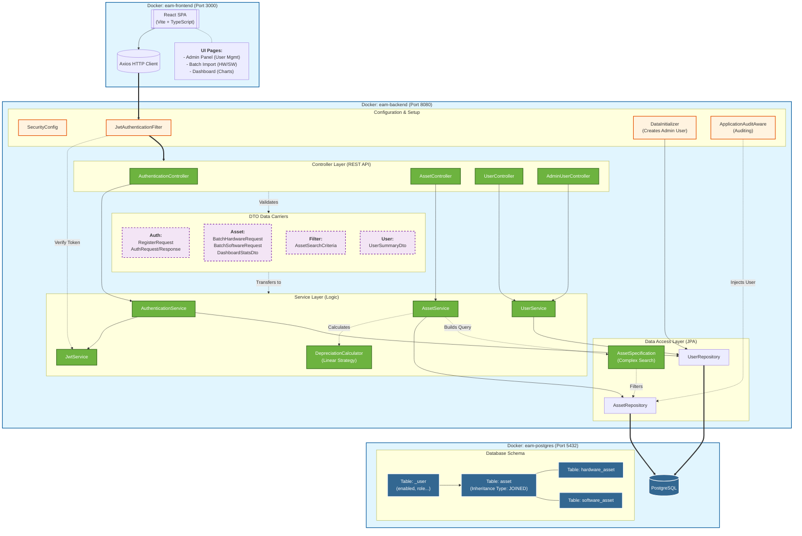
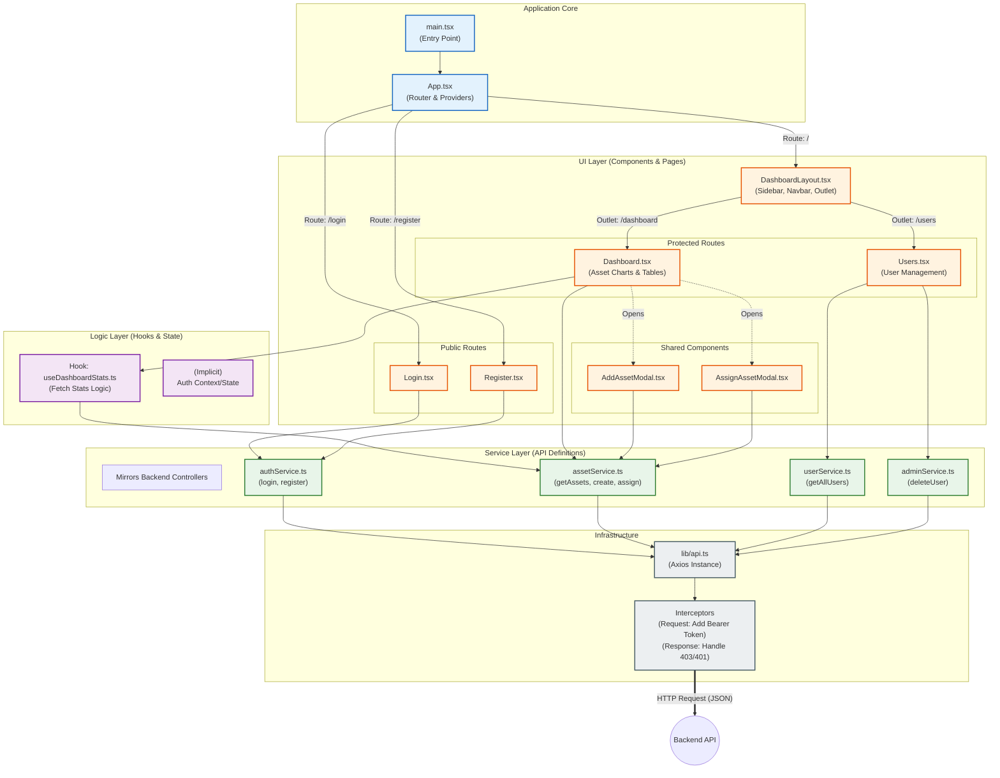

# Enterprise Asset Manager

> A robust, full-stack solution for orchestrating the complete lifecycle of organizational assets—from acquisition to disposal—with real-time financial auditing and secure access control.


## 💡 Introduction

**Enterprise Asset Manager (EAM)** bridges the gap between IT operations and financial accountability. It is designed to solve the chaos of spreadsheet-based tracking by providing a centralized, containerized platform for managing Hardware and Software assets.

Unlike simple inventory lists, EAM offers **intelligent lifecycle management**—automatically calculating depreciation, tracking assignment history, and ensuring data integrity through strictly typed APIs and audit trails. Whether you are tracking laptop serial numbers or software license expirations, EAM provides the visibility needed to optimize resource allocation.

## ✨ Key Features

* **Unified Asset Registry**: distinct handling for **Hardware** (Serial Numbers) and **Software** (Licenses) with polymorphic data structures.
* **Real-Time Analytics Dashboard**: Instant visualization of Total Asset Value, Active Licenses, and Availability status.
* **Advanced Search & Filtering**: Server-side pagination, sorting, and dynamic filtering to handle large datasets efficiently.
* **Audit & Compliance**: Built-in `AuditingEntityListener` automatically records creator and modifier timestamps for every record.
* **Lifecycle Automation**: "Soft Delete" functionality preserves historical data by marking assets as `DISPOSED` rather than permanently removing them.
* **Secure & Stateless**: Full JWT-based authentication flow integrated with Spring Security.

## 🛠 Tech Stack

### **Backend (The Core)**
* **Framework**: Spring Boot (Web, Data JPA, Validation)
* **Security**: Spring Security + JWT (Stateless Authentication)
* **Database**: PostgreSQL 16
* **Build Tool**: Gradle (Java 21 Toolchain)
* **Utilities**: Lombok, Jackson

### **Frontend (The Interface)**
* **Framework**: React 18 + TypeScript
* **Build System**: Vite
* **Styling**: Tailwind CSS + Lucide React (Icons)
* **State/Network**: Axios + Custom Hooks

### **Infrastructure**
* **Containerization**: Docker & Docker Compose
* **Networking**: Internal Bridge Network (`eam-network`)

### 🏗️ Architecture Diagrams

#### System Architecture



#### Frontend Architecture (前端架构)


## 🚀 Quick Start

### Prerequisites
* **Docker** & **Docker Compose** (Recommended)
* *Or for local dev*: Java 21, Node.js 18+, PostgreSQL

### Installation

The project is pre-configured with `docker-compose` for a one-step deployment.

1.  **Clone the repository**
    ```bash
    git clone [https://github.com/your-username/enterprise-asset-manager.git](https://github.com/your-username/enterprise-asset-manager.git)
    cd enterprise-asset-manager
    ```

2.  **Start the Application**
    ```bash
    # Builds both backend and frontend images and starts the database
    docker-compose up --build
    ```

3.  **Access the System**
    * **Frontend**: [http://localhost:3000](http://localhost:3000)
    * **Backend API**: [http://localhost:8080/api/v1](http://localhost:8080/api/v1)
    * **API Docs (Swagger)**: [http://localhost:8080/swagger-ui.html](http://localhost:8080/swagger-ui.html)


## 💻 Usage

### API Logic Example
EAM uses a polymorphic API design. Below is an example of how the backend handles asset creation, differentiating between Hardware and Software based on the endpoint.

```java
// AssetController.java
@RestController
@RequestMapping("api/v1/assets")
public class AssetController {

    // Dedicated endpoint for Hardware (requires Serial Number)
    @PostMapping("/hardware")
    public Asset createHardware(@RequestBody HardwareAsset asset) {
        return assetService.createAsset(asset);
    }

    // Dedicated endpoint for Software (requires License Key)
    @PostMapping("/software")
    public Asset createSoftware(@RequestBody SoftwareAsset asset) {
        return assetService.createAsset(asset);
    }
    
    // Universal Search with Pagination
    @GetMapping("/search")
    public Page<Asset> searchAssets(@ModelAttribute AssetSearchCriteria criteria, Pageable pageable) {
        return assetService.searchAssets(criteria, pageable);
    }
}

```

### Dashboard View

The frontend utilizes a custom hook `useDashboardStats` to aggregate financial data:

```typescript
// Dashboard.tsx
const { stats } = useDashboardStats();

// Automatically formats currency based on locale
<StatCard 
    title="Total Value" 
    value={formatCurrency(stats?.totalValue ?? 0)} 
    icon={<DollarSign />} 
/>

```

## ⚙️ Configuration

The application is configured via environment variables. You can adjust these in `docker-compose.yml`.

| Variable | Description | Default |
| --- | --- | --- |
| `SPRING_DATASOURCE_URL` | PostgreSQL connection URL | `jdbc:postgresql://db:5432/...` |
| `SPRING_JPA_HIBERNATE_DDL_AUTO` | Database schema management | `update` |
| `APPLICATION_SECURITY_JWT_SECRET_KEY` | 256-bit key for signing tokens | *(See docker-compose)* |
| `APPLICATION_SECURITY_JWT_EXPIRATION` | Token validity in milliseconds | `86400000` (24h) |
| `POSTGRES_DB` | Database Name | `asset_management_db` |

## 🤝 Contributing

1. Fork the Project
2. Create your Feature Branch (`git checkout -b feature/AmazingFeature`)
3. Commit your Changes (`git commit -m 'Add some AmazingFeature'`)
4. Push to the Branch (`git push origin feature/AmazingFeature`)
5. Open a Pull Request

```

```